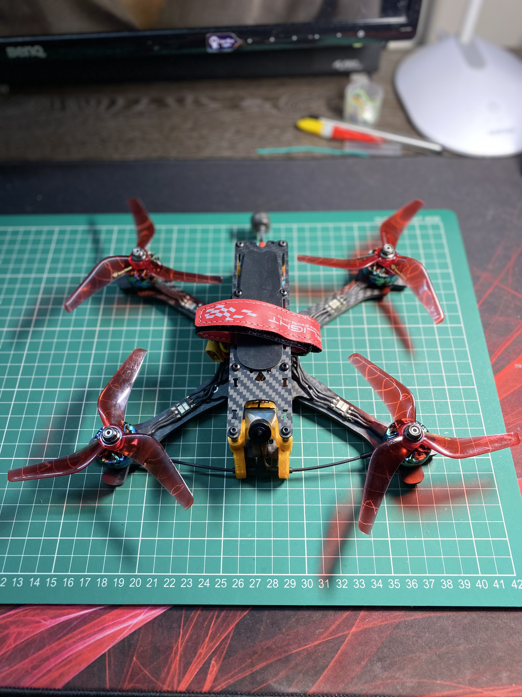
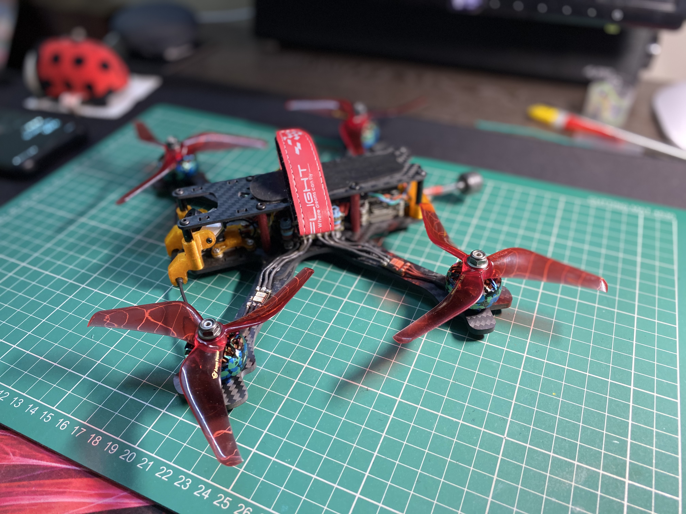
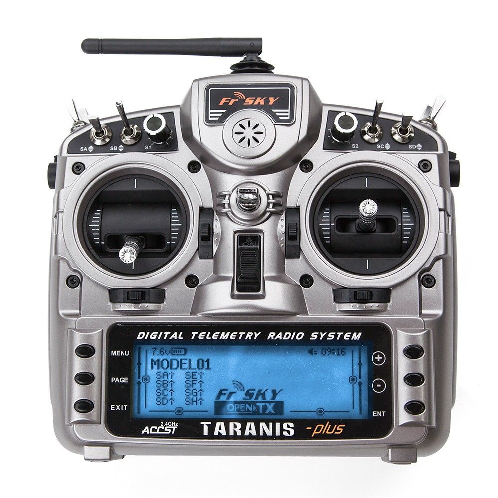
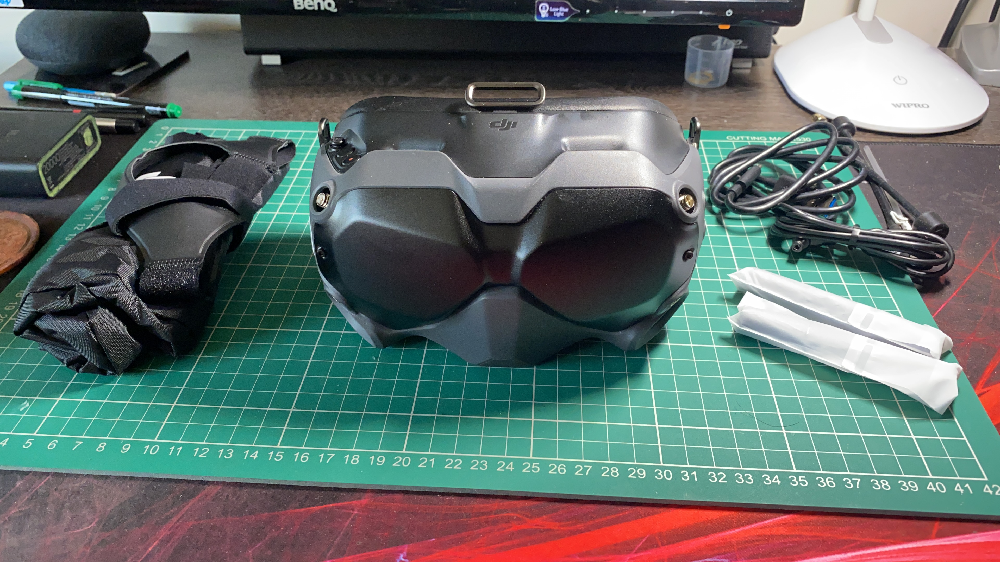

# Drone Build Configuration 1 - 5-Inch FREESTYLE HD BUILD

# Images

{ align=left }
{ align=left }

## Build Components

The drone we are building makes use of the following components

| SL  | Component         | Brand & Model Name                 | Quantity |
| --- | :---------------- | :--------------------------------- | :------: |
| 01  | Frame             | TBS Source One v3 5-inch           |    1     |
| 02  | Flight Controller | Diatone Mamba F722S                |    1     |
| 03  | ESC               | Diatone Mamba F50 Pro BLHeli32 50A |    1     |
| 04  | Video Transmitter | Caddx Vista                        |    1     |
| 05  | Radio Receiver    | TBS Nano Rx                        |    1     |
| 06  | Video Antenna     | LHCP Lollipop (comes with Vista)   |    1     |
| 07  | Radio Antenna     | TBS Immortal-T Antenna             |    1     |
| 08  | Motors            | TMotor Pacer V2 2207 1950KV        |    4     |
| 09  | Propellers        | GemFan/DalProp/HQProp 5.1x4.2x3    |    4     |
| 10  | Battery           | 1300mAh 6S battery                 |    1     |
| 11  | Camera            | Caddx Nebula Pro                   |    1     |
| 12  | Buzzer            | GepRC Super Buzzer                 |    1     |

## Non-drone Parts

| SL  | Component              | Brand & Model Name                          | Quantity |
| --- | :--------------------- | :------------------------------------------ | :------: |
| 01  | Radio Controller       | RadioMaster TX16S Controller/TBS Tango 2 v3 |    1     |
| 02  | Video Receiver Goggles | DJI Goggles v2                              |    1     |

The parts listed in this section refer to components/devices that are needed for flying FPV drones, but are not parts
that are added into the drone itself.

### **Transmitter/Controller**

We recommend investing in a decent radio transmitter, as these devices work with multiple drones and will last many years. We recommend tone of the following Radio Transmitters:

#### **RadioMaster TX16S (mid range)**

{ align=left }
Useful Links:

- [Review by Joshua Bardwell](https://www.youtube.com/watch?v=ddMP2gnZQck)

- [Review by RCModelReviews](https://www.youtube.com/watch?v=fJcZ3LCvEXI)

- [Buy at InsideFPV](https://www.insidefpv.com/product/radiomaster-tx16s-hall-sensor-gimbals-2-4g-16ch-multi-protocol-rf-system-opentx-mode2-transmitter-for-rc-drone-mode-2-left-hand-throttle-tx16s/)
  NOTE: Make sure to go for one of the above with 'Hall Sensor' Gimbals instead of the standard potentiometer-based gimbals, which don't last long.

#### **FrSky Taranis X9D Plus 2019 Special Edition (high end)**

{ align=left }

Useful Links:

- [Review by Albert Kim](https://www.youtube.com/watch?v=onjRkSSAo5w)

- [Review by Painless360](https://www.youtube.com/watch?v=csVWUOw8JM0&t=24s)

- [Buy at Quadkopters](https://www.quadkopters.com/product/tx-and-rx/frsky-taranis-x9d-plus-special-edition/)

### **FPV Goggles**

{ align=left }

These can become the largest singular investment in the entire build, as respectable goggles don't come cheap. Since this is a digital build, we really have no choice here, and the [DJI v2 Goggles](https://anubisrc.com/product/dji-fpv-goggles-v2/) is the only way to go. These goggles cost anywhere between 50K to 70K INR.
