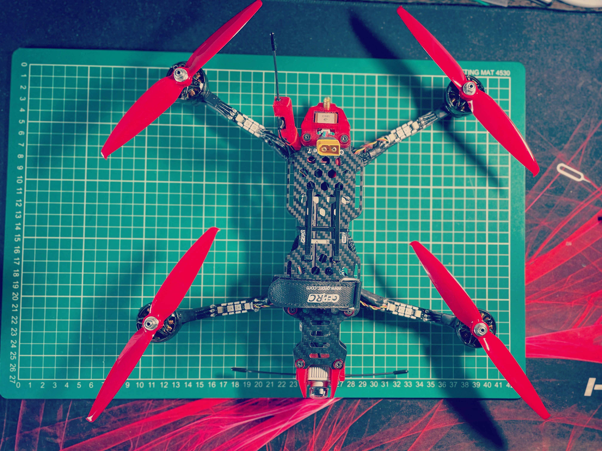
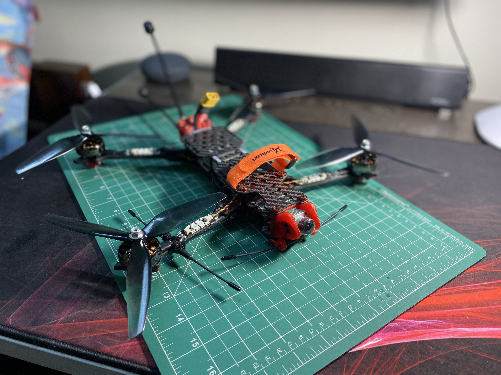

# Drone Build Configuration 1 - 7-Inch LONG RANGE HD BUILD

# Images

{ align=left }
{ align=left }

## Build Components

The drone we are building makes use of the following components

| SL  | Component         | Brand & Model Name                          | Quantity |
| --- | :---------------- | :------------------------------------------ | :------: |
| 01  | Frame             | GepRC Crocodile 7/TBS Source One 7 Inch     |    1     |
| 02  | Flight Controller | Diatone Mamba F722S                         |    1     |
| 03  | ESC               | Diatone Mamba F50 Pro BLHeli32 50A          |    1     |
| 04  | Video Transmitter | DJI Air Unit                                |    1     |
| 05  | Radio Controller  | RadioMaster TX16S Controller/TBS Tango 2 v3 |    1     |
| 06  | Radio Receiver    | TBS Nano Diversity Rx                       |    1     |
| 07  | Video Antenna     | iFlight Albatross RHCP                      |    2     |
| 08  | Radio Antenna     | TBS Immortal-T Antenna                      |    2     |
| 09  | Motors            | EMAX Eco-II 2807 1300KV                     |    4     |
| 10  | Propellers        | GemFan/DalProp 7x4x3                        |    4     |
| 11  | Battery           | 1300mAh 6S battery                          |    1     |
| 12  | Camera            | Caddx Nebula Pro                            |    1     |
| 13  | Buzzer            | GepRC Super Buzzer                          |    1     |
| 14  | GPS               | TBS M8.2 GLONASS GPS                        |    1     |

## Non-drone Parts (same as build 1)

The parts listed in this section refer to components/devices that are needed for flying FPV drones, but are not parts
that are added into the drone itself.

- Radio Transmitter/Controller (TX) - We recommend investing in a decent radio transmitter, as these devices work with multiple drones and will last many years. We recommend tone of the following Radio Transmitters:

  - **RadioMaster TX16S (mid range)**

    - [Review by Joshua Bardwell](https://www.youtube.com/watch?v=ddMP2gnZQck)
    - [Review by RCModelReviews](https://www.youtube.com/watch?v=fJcZ3LCvEXI)
    - [Buy at InsideFPV](https://www.insidefpv.com/product/radiomaster-tx16s-hall-sensor-gimbals-2-4g-16ch-multi-protocol-rf-system-opentx-mode2-transmitter-for-rc-drone-mode-2-left-hand-throttle-tx16s/)

  - **FrSky Taranis X9D Plus 2019 Special Edition (high end)**

    - [Review by Albert Kim](https://www.youtube.com/watch?v=onjRkSSAo5w)
    - [Review by Painless360](https://www.youtube.com/watch?v=csVWUOw8JM0&t=24s)
    - [Buy at Quadkopters](https://www.quadkopters.com/product/tx-and-rx/frsky-taranis-x9d-plus-special-edition/)

      NOTE: Make sure to go for one of the above with 'Hall Sensor' Gimbals instead of the standard potentiometer-based gimbals, which don't last long.

- **FPV Goggles** - These can become the largest singular investment in the entire build, as respectable goggles don't come cheap.
